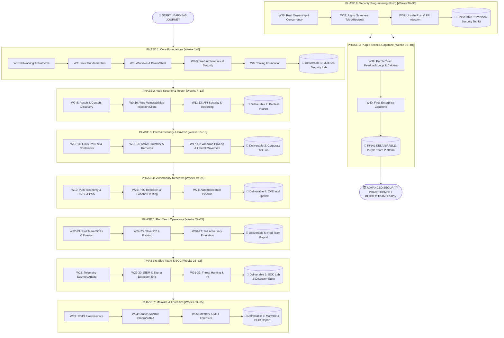

# 🗺️ CYBERSECURITY MASTER ROADMAP: RED TEAM + BLUE TEAM + RESEARCH + ENGINEERING

> **Master Curriculum:** 40 Weeks • 200 Days • 9 Industry Deliverables  
> **Target:** Advanced Security Practitioner / Purple Team Operator  
> **Curriculum Composition:** 76 Light Days (Theory & Reading) • 124 Full Days (Hands-on Lab & Deliverable)  
> **Standards:** MITRE ATT&CK • Cyber Kill Chain • SANS PICERL • NIST SP 800-61

---

## 🧭 Visual Flow Diagram

```text
╔════════════════════════════════════════════════════════════════════════════════════════════════════════════════════════════╗
║                 🛡️  CYBERSECURITY MASTER ROADMAP: RED TEAM + BLUE TEAM + RESEARCH + ENGINEERING                         ║
║                              TARGET: ADVANCED SECURITY PRACTITIONER / PURPLE TEAM                                         ║
╚════════════════════════════════════════════════════════════════════════════════════════════════════════════════════════════╝

                                  ╔══════════════════════════════╗
                                  ║      START YOUR JOURNEY      ║
                                  ╚════════════════════╦═════════╝
                                                       ▼
┌───────────────────────────────────────────────────────────────────────────────────────────────────────────────────────────┐
│  PHASE 1: CORE FOUNDATIONS — NETWORKING + LINUX + WINDOWS + WEB                                         [WEEKS 1–6]       │
│  ● Week 1: Networking & Protocols (TCP/IP, OSI, Subnetting, BPF, Wireshark)                        [4 Light • 1 Full]     │
│  ● Week 2: Linux Fundamentals & System Administration (FHS, Permissions, systemd, Audit)            [3 Light • 2 Full]     │
│  ● Week 3: Windows Internals & PowerShell Security (Registry, Tokens, ACLs, Sysmon)                 [3 Light • 2 Full]     │
│  ● Weeks 4–5: Web Architecture & Web Security Fundamentals (HTTP, Cookies, SOP/CORS, SSRF, SQLi)    [6 Light • 4 Full]     │
│  ● Week 6: Security Tooling Foundation (Kali, Nmap, Burp Suite, Python Automation)                  [1 Light • 4 Full]     │
│  📌 DELIVERABLE 1: Multi-OS Security Lab Environment (Kali + Windows + Linux + Web Lab)                                   │
└──────────────────────────────────────────────────┬────────────────────────────────────────────────────────────────────────┘
                                                   ▼
┌───────────────────────────────────────────────────────────────────────────────────────────────────────────────────────────┐
│  PHASE 2: WEB APPLICATION SECURITY + RECONNAISSANCE                                                     [WEEKS 7–12]      │
│  ● Weeks 7–8: Reconnaissance, OSINT & Content Discovery (DNS, Shodan, CT Logs, FFUF, Nuclei)        [5 Light • 5 Full]     │
│  ● Weeks 9–10: Server-Side & Client-Side Web Vulnerabilities (SQLi, SSTI, Deserialization, XSS, SSRF)[3 Light • 7 Full]     │
│  ● Weeks 11–12: Modern Application & API Security (BOLA, JWT, GraphQL, Race Conditions) & Reporting  [3 Light • 7 Full]     │
│  📌 DELIVERABLE 2: Web Security Lab + Professional Penetration Test Report                                                │
└──────────────────────────────────────────────────┬────────────────────────────────────────────────────────────────────────┘
                                                   ▼
┌───────────────────────────────────────────────────────────────────────────────────────────────────────────────────────────┐
│  PHASE 3: PRIVILEGE ESCALATION + INTERNAL SECURITY                                                      [WEEKS 13–18]     │
│  ● Weeks 13–14: Linux Privilege Escalation & Container Breakouts (SUID, Capabilities, Sudo, Docker) [2 Light • 8 Full]     │
│  ● Weeks 15–16: Active Directory Fundamentals & Attack Paths (Kerberos, BloodHound, AD CS, Delegation)[4 Light • 6 Full]   │
│  ● Weeks 17–18: Windows Privilege Escalation & Lateral Movement (Services, Tokens, Mimikatz, PtH, WMI)[2 Light • 8 Full]   │
│  📌 DELIVERABLE 3: Corporate Active Directory Lab & Compromise Path Documentation                                         │
└──────────────────────────────────────────────────┬────────────────────────────────────────────────────────────────────────┘
                                                   ▼
┌───────────────────────────────────────────────────────────────────────────────────────────────────────────────────────────┐
│  PHASE 4: VULNERABILITY RESEARCH + CVE INTELLIGENCE                                                     [WEEKS 19–21]     │
│  ● Week 19: Vulnerability Fundamentals, Taxonomy & CVSS v3.1/v4.0 / EPSS Scoring                     [4 Light • 1 Full]     │
│  ● Week 20: CVE / PoC Research & Safe Sandbox Reproduction                                          [2 Light • 3 Full]     │
│  ● Week 21: Automated Vulnerability Intelligence & Feed Ingestion Pipeline (trickest/cve)           [2 Light • 3 Full]     │
│  📌 DELIVERABLE 4: CVE Research & Intelligence Pipeline (Feed Ingestion + Version Matching + PoC Triage)                  │
└──────────────────────────────────────────────────┬────────────────────────────────────────────────────────────────────────┘
                                                   ▼
┌───────────────────────────────────────────────────────────────────────────────────────────────────────────────────────────┐
│  PHASE 5: RED TEAM OPERATIONS + ADVERSARY EMULATION                                                     [WEEKS 22–27]     │
│  ● Weeks 22–23: Red Team Methodology, Tiered C2 Architecture, OPSEC & Weaponization                 [6 Light • 4 Full]     │
│  ● Weeks 24–25: Command & Control with Sliver, Listeners, Beacons, In-Memory Execution & Pivoting    [2 Light • 8 Full]     │
│  ● Weeks 26–27: Full Authorized Adversary Emulation Exercise (Recon → Domain Admin → Deconfliction)  [2 Light • 8 Full]     │
│  📌 DELIVERABLE 5: Full Red Team Engagement Report (Executive Summary + ATT&CK Matrix + Blue Deconfliction)               │
└──────────────────────────────────────────────────┬────────────────────────────────────────────────────────────────────────┘
                                                   ▼
┌───────────────────────────────────────────────────────────────────────────────────────────────────────────────────────────┐
│  PHASE 6: BLUE TEAM + SOC + THREAT HUNTING                                                              [WEEKS 28–32]     │
│  ● Week 28: Security Telemetry & Endpoint Visibility (Sysmon, Windows Event Logs, Linux Auditd)     [2 Light • 3 Full]     │
│  ● Weeks 29–30: SIEM Architecture (Wazuh/Elastic) & Detection Engineering with Sigma Rules          [3 Light • 7 Full]     │
│  ● Weeks 31–32: Threat Hunting Methodologies & Incident Response Triage (PICERL)                    [3 Light • 7 Full]     │
│  📌 DELIVERABLE 6: SOC & Detection Engineering Lab (Wazuh SIEM + Sysmon + Custom Sigma Rule Suite)                       │
└──────────────────────────────────────────────────┬────────────────────────────────────────────────────────────────────────┘
                                                   ▼
┌───────────────────────────────────────────────────────────────────────────────────────────────────────────────────────────┐
│  PHASE 7: MALWARE ANALYSIS + DIGITAL FORENSICS                                                          [WEEKS 33–35]     │
│  ● Week 33: Malware Architecture, PE/ELF Headers, Packing & Anti-Analysis                           [4 Light • 1 Full]     │
│  ● Week 34: Static Disassembly (Ghidra), Dynamic Analysis (Procmon, FakeNet-NG) & YARA Rules        [0 Light • 5 Full]     │
│  ● Week 35: Digital Forensics & Incident Reconstruction (Volatility 3, Prefetch, Shimcache, MFT)    [2 Light • 3 Full]     │
│  📌 DELIVERABLE 7: Malware Triage + Forensics Report (Sample Dissection + YARA Rule + Memory Reconstruction)             │
└──────────────────────────────────────────────────┬────────────────────────────────────────────────────────────────────────┘
                                                   ▼
┌───────────────────────────────────────────────────────────────────────────────────────────────────────────────────────────┐
│  PHASE 8: SECURITY PROGRAMMING + RUST + TOOL DEVELOPMENT                                                [WEEKS 36–38]     │
│  ● Week 36: Rust Fundamentals for Hackers (Ownership, Borrowing, Structs, Concurrency)              [4 Light • 1 Full]     │
│  ● Week 37: Security Tool Engineering in Rust (Tokio Async Port Scanner, Reqwest Prober, Serde)     [1 Light • 4 Full]     │
│  ● Week 38: Low-Level Security Concepts (Unsafe Rust, FFI, Win32 API Injection, Raw Sockets)        [1 Light • 4 Full]     │
│  📌 DELIVERABLE 8: Personal Security Toolkit (Compiled Rust Utilities + Performance Benchmarks)                           │
└──────────────────────────────────────────────────┬────────────────────────────────────────────────────────────────────────┘
                                                   ▼
┌───────────────────────────────────────────────────────────────────────────────────────────────────────────────────────────┐
│  PHASE 9: PURPLE TEAM + AUTOMATION + CAPSTONE                                                           [WEEKS 39–40]     │
│  ● Week 39: Purple Team Integration (Attack → Telemetry → Detection → Retest Loop & Automation)     [2 Light • 3 Full]     │
│  ● Week 40: Final Capstone Enterprise Hybrid Simulation, Defense Engineering & Master Portfolio     [1 Light • 4 Full]     │
│  📌 FINAL DELIVERABLE: "Purple Team Security Operations Platform"                                                         │
└──────────────────────────────────────────────────┬────────────────────────────────────────────────────────────────────────┘
                                                   ▼
                         ╔══════════════════════════════════════════════════════════╗
                         ║                 🎯 ADVANCED SECURITY READY                ║
                         ║                                                          ║
                         ║  RED TEAM  →  BLUE TEAM  →  SECURITY RESEARCH            ║
                         ║       →  AUTOMATION  →  PURPLE TEAM                      ║
                         ║                                                          ║
                         ║  Web Security • AD • Cloud • SOC • DFIR • C2             ║
                         ║  Vulnerability Research • Malware • Rust • Tooling       ║
                         ╚══════════════════════════════════════════════════════════╝
```

---

## 📊 Interactive Mermaid Architecture Flow



---

## 📅 Master 40-Week Schedule & Tier Allocation

| Week | Title | Phase | Day Span | Tiers (Light/Full) | Milestone Deliverable |
| :--- | :--- | :--- | :---: | :---: | :--- |
| [**Week 01**](phase-01-foundations/week-01-networking/README.md) | Networking & Protocols | Phase 01 | `Day 001–005` | `4L • 1F` | Network Traffic Analysis Portfolio (PCAP captures, filter cheatsheet, and Wireshark stream reconstructions) |
| [**Week 02**](phase-01-foundations/week-02-linux/README.md) | Linux Fundamentals & System Administration | Phase 01 | `Day 006–010` | `3L • 2F` | Linux Security Baseline Script & Host Audit Report |
| [**Week 03**](phase-01-foundations/week-03-windows/README.md) | Windows Internals & PowerShell Security | Phase 01 | `Day 011–015` | `3L • 2F` | Windows Host Auditing & Telemetry Baseline (Sysmon config + PowerShell triage script) |
| [**Week 04**](phase-01-foundations/week-04-web-architecture/README.md) | Web Architecture & Core Protocols | Phase 01 | `Day 016–020` | `3L • 2F` | Web Security Header & Architecture Audit Matrix |
| [**Week 05**](phase-01-foundations/week-05-web-security/README.md) | Web Security Fundamentals | Phase 01 | `Day 021–025` | `3L • 2F` | Web Vulnerability Root-Cause & Remediation Notebook |
| [**Week 06**](phase-01-foundations/week-06-tooling/README.md) | Security Tooling Foundation | Phase 01 | `Day 026–030` | `1L • 4F` | Deliverable 1: Security Lab Environment (Kali + Windows Target + Linux Target + Web Lab + GitHub Documentation) |
| [**Week 07**](phase-02-web-recon/week-07-recon-osint/README.md) | Passive & Active Reconnaissance | Phase 02 | `Day 031–035` | `3L • 2F` | Passive Target Dossier & Subdomain Takeover Audit Sheet |
| [**Week 08**](phase-02-web-recon/week-08-scanning-content-discovery/README.md) | Attack Surface Mapping & Content Discovery | Phase 02 | `Day 036–040` | `2L • 3F` | Attack Surface & Technology Profile Matrix |
| [**Week 09**](phase-02-web-recon/week-09-web-vulnerabilities-1/README.md) | Server-Side Web Vulnerabilities | Phase 02 | `Day 041–045` | `1L • 4F` | Server-Side Exploitation & Remediation Guidebook |
| [**Week 10**](phase-02-web-recon/week-10-web-vulnerabilities-2/README.md) | Client-Side & File Vulnerabilities | Phase 02 | `Day 046–050` | `2L • 3F` | Client-Side & File Vulnerability Proof-of-Concept Suite |
| [**Week 11**](phase-02-web-recon/week-11-modern-app-api-security/README.md) | Modern Application & API Security | Phase 02 | `Day 051–055` | `1L • 4F` | API Security Audit Checklist & Exploitation Proof-of-Concepts |
| [**Week 12**](phase-02-web-recon/week-12-business-logic-reporting/README.md) | Business Logic, Methodology & Reporting | Phase 02 | `Day 056–060` | `3L • 2F` | Deliverable 2: Web Security Lab + Professional Penetration Test Report (Executive Summary + Technical Findings + PoCs + Remediations) |
| [**Week 13**](phase-03-internal-security/week-13-linux-privesc-foundations/README.md) | Linux Privilege Escalation Foundations | Phase 03 | `Day 061–065` | `1L • 4F` | Linux Privilege Escalation Playbook & GTFOBins Cheatsheet |
| [**Week 14**](phase-03-internal-security/week-14-linux-privesc-advanced/README.md) | Advanced Linux PrivEsc & Container Security | Phase 03 | `Day 066–070` | `1L • 4F` | Container Security Audit Checklist & Linux Rootkit/Persistence Analysis |
| [**Week 15**](phase-03-internal-security/week-15-active-directory-foundations/README.md) | Active Directory Architecture & Authentication | Phase 03 | `Day 071–075` | `3L • 2F` | Active Directory Architecture Blueprint & Kerberos Attack Playbook |
| [**Week 16**](phase-03-internal-security/week-16-active-directory-attacks/README.md) | Active Directory Attack Paths & Delegation | Phase 03 | `Day 076–080` | `1L • 4F` | BloodHound Attack Path Analysis & Domain Escalation Matrix |
| [**Week 17**](phase-03-internal-security/week-17-windows-privesc/README.md) | Windows Privilege Escalation | Phase 03 | `Day 081–085` | `1L • 4F` | Windows Privilege Escalation Triage Matrix & Exploit Walkthroughs |
| [**Week 18**](phase-03-internal-security/week-18-lateral-movement/README.md) | Lateral Movement & Internal Pivoting | Phase 03 | `Day 086–090` | `1L • 4F` | Deliverable 3: Corporate Active Directory Lab & Compromise Path Documentation |
| [**Week 19**](phase-04-cve-research/week-19-vulnerability-fundamentals/README.md) | Vulnerability Fundamentals & Scoring | Phase 04 | `Day 091–095` | `4L • 1F` | Vulnerability Taxonomy & Severity Scoring Guidebook |
| [**Week 20**](phase-04-cve-research/week-20-cve-poc-research/README.md) | CVE / PoC Research & Safe Lab Reproduction | Phase 04 | `Day 096–100` | `2L • 3F` | CVE Safe Reproduction & Patch Verification Dossier |
| [**Week 21**](phase-04-cve-research/week-21-vulnerability-intelligence/README.md) | Automated Vulnerability Intelligence Pipeline | Phase 04 | `Day 101–105` | `2L • 3F` | Deliverable 4: CVE Research & Intelligence Pipeline (Source code, sample ingested data, version matcher, and automated advisory) |
| [**Week 22**](phase-05-red-team/week-22-red-team-methodology/README.md) | Red Team Methodology & OPSEC Architecture | Phase 05 | `Day 106–110` | `5L • 0F` | Red Team Standard Operating Procedure (SOP) & Infrastructure Architecture Blueprint |
| [**Week 23**](phase-05-red-team/week-23-weaponization-evasion/README.md) | Initial Access & Weaponization Tradecraft | Phase 05 | `Day 111–115` | `1L • 4F` | Offensive Weaponization & Evasion Tradecraft Reference |
| [**Week 24**](phase-05-red-team/week-24-c2-architecture-sliver/README.md) | Command & Control Architecture with Sliver | Phase 05 | `Day 116–120` | `1L • 4F` | Sliver C2 Operator Playbook & Configuration Reference |
| [**Week 25**](phase-05-red-team/week-25-c2-pivoting-traffic/README.md) | Advanced C2 Operations, Pivoting & Traffic Analysis | Phase 05 | `Day 121–125` | `1L • 4F` | Adversary Pivoting & Network Tunneling Operational Guide |
| [**Week 26**](phase-05-red-team/week-26-adversary-simulation-1/README.md) | Full Authorized Adversary Emulation Exercise — Part 1 | Phase 05 | `Day 126–130` | `1L • 4F` | Simulation Phase 1 Operations Log & Intermediate Finding Briefing |
| [**Week 27**](phase-05-red-team/week-27-adversary-simulation-2/README.md) | Full Authorized Adversary Emulation Exercise — Part 2 & Reporting | Phase 05 | `Day 131–135` | `1L • 4F` | Deliverable 5: Full Red Team Engagement Report (Executive Summary + Attack Narrative + MITRE ATT&CK Matrix + Blue Team Deconfliction) |
| [**Week 28**](phase-06-blue-team/week-28-security-monitoring-telemetry/README.md) | Security Telemetry & Endpoint Visibility | Phase 06 | `Day 136–140` | `2L • 3F` | Enterprise Telemetry Baseline & Collection Blueprint |
| [**Week 29**](phase-06-blue-team/week-29-siem-log-analytics/README.md) | SIEM Architecture & Log Analytics | Phase 06 | `Day 141–145` | `2L • 3F` | SIEM Deployment Blueprint & Custom Decoder Repository |
| [**Week 30**](phase-06-blue-team/week-30-detection-engineering/README.md) | Detection Engineering with Sigma & ATT&CK | Phase 06 | `Day 146–150` | `1L • 4F` | Sigma Detection Rule Suite (Rules, ATT&CK mapping, and validation logs) |
| [**Week 31**](phase-06-blue-team/week-31-threat-hunting/README.md) | Threat Hunting Methodologies & TTP Investigation | Phase 06 | `Day 151–155` | `1L • 4F` | Threat Hunting Report & Query Playbook |
| [**Week 32**](phase-06-blue-team/week-32-incident-response/README.md) | Incident Response Lifecycle & Triage | Phase 06 | `Day 156–160` | `2L • 3F` | Deliverable 6: SOC & Detection Engineering Lab (SIEM Setup + Sigma Detection Suite + Incident Response Triage Documentation) |
| [**Week 33**](phase-07-malware-forensics/week-33-malware-fundamentals/README.md) | Malware Architecture & Fundamentals | Phase 07 | `Day 161–165` | `4L • 1F` | Binary Anatomy & Safe Malware Lab Architecture Guide |
| [**Week 34**](phase-07-malware-forensics/week-34-static-dynamic-analysis/README.md) | Static & Dynamic Malware Analysis | Phase 07 | `Day 166–170` | `0L • 5F` | Malware Analysis Report & Custom YARA Rule Repository |
| [**Week 35**](phase-07-malware-forensics/week-35-digital-forensics/README.md) | Digital Forensics & Incident Reconstruction | Phase 07 | `Day 171–175` | `0L • 5F` | Deliverable 7: Malware Triage + Forensics Report (Memory Analysis + Disk Artifact Timelines + Incident Reconstruction) |
| [**Week 36**](phase-08-security-programming/week-36-rust-fundamentals/README.md) | Rust Fundamentals for Security Practitioners | Phase 08 | `Day 176–180` | `4L • 1F` | Rust Core Systems Programming Reference & Exercise Suite |
| [**Week 37**](phase-08-security-programming/week-37-security-tool-engineering/README.md) | Security Tool Engineering in Rust | Phase 08 | `Day 181–185` | `1L • 4F` | Compiled Rust Security Utility Binaries & Source Repository |
| [**Week 38**](phase-08-security-programming/week-38-low-level-security/README.md) | Low-Level Security Concepts & Binary Tooling | Phase 08 | `Day 186–190` | `1L • 4F` | Deliverable 8: Personal Security Toolkit (Compiled Rust & Python Utilities + Source Code + Performance Benchmarks) |
| [**Week 39**](phase-09-purple-team/week-39-purple-team-integration/README.md) | Purple Team Integration & Continuous Retesting | Phase 09 | `Day 191–195` | `2L • 3F` | Purple Team Exercise Matrix & Detection Tuning Playbook |
| [**Week 40**](phase-09-purple-team/week-40-final-capstone/README.md) | Final Capstone Project & Security Operations Platform | Phase 09 | `Day 196–200` | `1L • 4F` | Final Deliverable: 'Purple Team Security Operations Platform' (Full Enterprise Simulation, Detection Suite, Architecture & Master Portfolio) |

---

## 📑 200 Days Master Index

| Day | Title | Tier | Week | Phase |
| :---: | :--- | :---: | :---: | :---: |
| [**Day 001**](days/day-001/README.md) | TCP/IP Architecture, OSI Model & The 3-Way Handshake | `[LIGHT]` | [W01](phase-01-foundations/week-01-networking/README.md) | [Phase 01](phase-01-foundations/README.md) |
| [**Day 002**](days/day-002/README.md) | IPv4, IPv6, CIDR Subnetting & Packet Fragmentation | `[LIGHT]` | [W01](phase-01-foundations/week-01-networking/README.md) | [Phase 01](phase-01-foundations/README.md) |
| [**Day 003**](days/day-003/README.md) | Core Protocols — ARP, ICMP, DHCP, NAT & Routing Mechanics | `[LIGHT]` | [W01](phase-01-foundations/week-01-networking/README.md) | [Phase 01](phase-01-foundations/README.md) |
| [**Day 004**](days/day-004/README.md) | Transport & Application Layers — DNS, HTTP/HTTPS & TLS Cryptography | `[LIGHT]` | [W01](phase-01-foundations/week-01-networking/README.md) | [Phase 01](phase-01-foundations/README.md) |
| [**Day 005**](days/day-005/README.md) | Network Traffic Analysis — tcpdump & Wireshark Stream Reconstruction | `[FULL]` | [W01](phase-01-foundations/week-01-networking/README.md) | [Phase 01](phase-01-foundations/README.md) |
| [**Day 006**](days/day-006/README.md) | Linux Filesystem Hierarchy (FHS), Users & Standard Permissions | `[LIGHT]` | [W02](phase-01-foundations/week-02-linux/README.md) | [Phase 01](phase-01-foundations/README.md) |
| [**Day 007**](days/day-007/README.md) | Special Permissions (SUID, SGID, Sticky Bit) & Process Execution | `[LIGHT]` | [W02](phase-01-foundations/week-02-linux/README.md) | [Phase 01](phase-01-foundations/README.md) |
| [**Day 008**](days/day-008/README.md) | Systemd Services, Daemons, Cron Tasks & SSH Key Hardening | `[LIGHT]` | [W02](phase-01-foundations/week-02-linux/README.md) | [Phase 01](phase-01-foundations/README.md) |
| [**Day 009**](days/day-009/README.md) | Virtual Filesystems (/proc, /sys), Environment Variables & Bash Automation | `[FULL]` | [W02](phase-01-foundations/week-02-linux/README.md) | [Phase 01](phase-01-foundations/README.md) |
| [**Day 010**](days/day-010/README.md) | Linux Logging (/var/log, journalctl), Networking & Host Investigation | `[FULL]` | [W02](phase-01-foundations/week-02-linux/README.md) | [Phase 01](phase-01-foundations/README.md) |
| [**Day 011**](days/day-011/README.md) | Windows OS Architecture — User Mode, Kernel Mode & PE Basics | `[LIGHT]` | [W03](phase-01-foundations/week-03-windows/README.md) | [Phase 01](phase-01-foundations/README.md) |
| [**Day 012**](days/day-012/README.md) | Windows Security Subsystem — LSASS, SAM, Tokens & ACLs | `[LIGHT]` | [W03](phase-01-foundations/week-03-windows/README.md) | [Phase 01](phase-01-foundations/README.md) |
| [**Day 013**](days/day-013/README.md) | Windows Services, Registry Architecture, Scheduled Tasks & UAC | `[LIGHT]` | [W03](phase-01-foundations/week-03-windows/README.md) | [Phase 01](phase-01-foundations/README.md) |
| [**Day 014**](days/day-014/README.md) | PowerShell for Security Operations — WMI, CIM & WinRM | `[FULL]` | [W03](phase-01-foundations/week-03-windows/README.md) | [Phase 01](phase-01-foundations/README.md) |
| [**Day 015**](days/day-015/README.md) | Windows Auditing — Security Event Logs, Sysmon & Endpoint Visibility | `[FULL]` | [W03](phase-01-foundations/week-03-windows/README.md) | [Phase 01](phase-01-foundations/README.md) |
| [**Day 016**](days/day-016/README.md) | HTTP Protocol Deep Dive, Headers, Cookies & Sessions | `[LIGHT]` | [W04](phase-01-foundations/week-04-web-architecture/README.md) | [Phase 01](phase-01-foundations/README.md) |
| [**Day 017**](days/day-017/README.md) | Browser Security Model — Same-Origin Policy (SOP), CORS & CSP | `[LIGHT]` | [W04](phase-01-foundations/week-04-web-architecture/README.md) | [Phase 01](phase-01-foundations/README.md) |
| [**Day 018**](days/day-018/README.md) | Authentication Architectures — Passwords, Sessions & JSON Web Tokens (JWT) | `[LIGHT]` | [W04](phase-01-foundations/week-04-web-architecture/README.md) | [Phase 01](phase-01-foundations/README.md) |
| [**Day 019**](days/day-019/README.md) | Modern Federated Identity — OAuth 2.0 & OpenID Connect (OIDC) | `[FULL]` | [W04](phase-01-foundations/week-04-web-architecture/README.md) | [Phase 01](phase-01-foundations/README.md) |
| [**Day 020**](days/day-020/README.md) | Web Infrastructure — Reverse Proxies, CDNs, WebSockets & APIs | `[FULL]` | [W04](phase-01-foundations/week-04-web-architecture/README.md) | [Phase 01](phase-01-foundations/README.md) |
| [**Day 021**](days/day-021/README.md) | API Architectures, RESTful Conventions & GraphQL Introspection | `[LIGHT]` | [W05](phase-01-foundations/week-05-web-security/README.md) | [Phase 01](phase-01-foundations/README.md) |
| [**Day 022**](days/day-022/README.md) | Cross-Site Scripting (XSS) Core Mechanics — Stored, Reflected & DOM | `[LIGHT]` | [W05](phase-01-foundations/week-05-web-security/README.md) | [Phase 01](phase-01-foundations/README.md) |
| [**Day 023**](days/day-023/README.md) | Cross-Site Request Forgery (CSRF) & SameSite Cookie Defenses | `[LIGHT]` | [W05](phase-01-foundations/week-05-web-security/README.md) | [Phase 01](phase-01-foundations/README.md) |
| [**Day 024**](days/day-024/README.md) | Server-Side Request Forgery (SSRF) Mechanics & Cloud Metadata | `[FULL]` | [W05](phase-01-foundations/week-05-web-security/README.md) | [Phase 01](phase-01-foundations/README.md) |
| [**Day 025**](days/day-025/README.md) | SQL Injection Fundamentals — Error-based, Union-based & Blind | `[FULL]` | [W05](phase-01-foundations/week-05-web-security/README.md) | [Phase 01](phase-01-foundations/README.md) |
| [**Day 026**](days/day-026/README.md) | Security Workstation Setup — Kali Linux, Shell Customization & Git OPSEC | `[LIGHT]` | [W06](phase-01-foundations/week-06-tooling/README.md) | [Phase 01](phase-01-foundations/README.md) |
| [**Day 027**](days/day-027/README.md) | Network Scanning & Port Enumeration with Nmap | `[FULL]` | [W06](phase-01-foundations/week-06-tooling/README.md) | [Phase 01](phase-01-foundations/README.md) |
| [**Day 028**](days/day-028/README.md) | Web Application Interception with Burp Suite | `[FULL]` | [W06](phase-01-foundations/week-06-tooling/README.md) | [Phase 01](phase-01-foundations/README.md) |
| [**Day 029**](days/day-029/README.md) | Python for Security Practitioners — Sockets, Requests & Automation | `[FULL]` | [W06](phase-01-foundations/week-06-tooling/README.md) | [Phase 01](phase-01-foundations/README.md) |
| [**Day 030**](days/day-030/README.md) | Phase 1 Capstone Deliverable — Security Lab Environment | `[FULL]` | [W06](phase-01-foundations/week-06-tooling/README.md) | [Phase 01](phase-01-foundations/README.md) |
| [**Day 031**](days/day-031/README.md) | Open Source Intelligence (OSINT) — Domain WHOIS, ASN Mapping & IP Scopes | `[LIGHT]` | [W07](phase-02-web-recon/week-07-recon-osint/README.md) | [Phase 02](phase-02-web-recon/README.md) |
| [**Day 032**](days/day-032/README.md) | Subdomain Enumeration — Passive (crt.sh, CT Logs) & Active Discovery | `[LIGHT]` | [W07](phase-02-web-recon/week-07-recon-osint/README.md) | [Phase 02](phase-02-web-recon/README.md) |
| [**Day 033**](days/day-033/README.md) | DNS Enumeration & Subdomain Takeover Analysis | `[LIGHT]` | [W07](phase-02-web-recon/week-07-recon-osint/README.md) | [Phase 02](phase-02-web-recon/README.md) |
| [**Day 034**](days/day-034/README.md) | Cloud Asset Reconnaissance — S3 Bucket Hunting & Exposed Storage | `[FULL]` | [W07](phase-02-web-recon/week-07-recon-osint/README.md) | [Phase 02](phase-02-web-recon/README.md) |
| [**Day 035**](days/day-035/README.md) | Source Code & Secret Leak Discovery — Git Reconnaissance & TruffleHog | `[FULL]` | [W07](phase-02-web-recon/week-07-recon-osint/README.md) | [Phase 02](phase-02-web-recon/README.md) |
| [**Day 036**](days/day-036/README.md) | Technology Stack Fingerprinting — Shodan, WhatWeb & Wappalyzer | `[LIGHT]` | [W08](phase-02-web-recon/week-08-scanning-content-discovery/README.md) | [Phase 02](phase-02-web-recon/README.md) |
| [**Day 037**](days/day-037/README.md) | Web Path & File Brute-Forcing — Gobuster & Feroxbuster | `[FULL]` | [W08](phase-02-web-recon/week-08-scanning-content-discovery/README.md) | [Phase 02](phase-02-web-recon/README.md) |
| [**Day 038**](days/day-038/README.md) | Client-Side JavaScript Analysis — Extracting DOM Endpoints & API Keys | `[FULL]` | [W08](phase-02-web-recon/week-08-scanning-content-discovery/README.md) | [Phase 02](phase-02-web-recon/README.md) |
| [**Day 039**](days/day-039/README.md) | Automated Vulnerability Scanning with Nuclei | `[LIGHT]` | [W08](phase-02-web-recon/week-08-scanning-content-discovery/README.md) | [Phase 02](phase-02-web-recon/README.md) |
| [**Day 040**](days/day-040/README.md) | Comprehensive Attack Surface Mapping Pipeline Integration | `[FULL]` | [W08](phase-02-web-recon/week-08-scanning-content-discovery/README.md) | [Phase 02](phase-02-web-recon/README.md) |
| [**Day 041**](days/day-041/README.md) | Advanced SQL Injection — Boolean Blind, Time-based Blind & Second-Order | `[LIGHT]` | [W09](phase-02-web-recon/week-09-web-vulnerabilities-1/README.md) | [Phase 02](phase-02-web-recon/README.md) |
| [**Day 042**](days/day-042/README.md) | NoSQL Injection & LDAP Injection in Web Authentication | `[FULL]` | [W09](phase-02-web-recon/week-09-web-vulnerabilities-1/README.md) | [Phase 02](phase-02-web-recon/README.md) |
| [**Day 043**](days/day-043/README.md) | OS Command Injection — Filter Bypasses & Out-of-Band (OOB) Extraction | `[FULL]` | [W09](phase-02-web-recon/week-09-web-vulnerabilities-1/README.md) | [Phase 02](phase-02-web-recon/README.md) |
| [**Day 044**](days/day-044/README.md) | Server-Side Template Injection (SSTI) to Remote Code Execution (RCE) | `[FULL]` | [W09](phase-02-web-recon/week-09-web-vulnerabilities-1/README.md) | [Phase 02](phase-02-web-recon/README.md) |
| [**Day 045**](days/day-045/README.md) | Insecure Deserialization — Python, PHP & Java Gadget Chains | `[FULL]` | [W09](phase-02-web-recon/week-09-web-vulnerabilities-1/README.md) | [Phase 02](phase-02-web-recon/README.md) |
| [**Day 046**](days/day-046/README.md) | Advanced Cross-Site Scripting (XSS) — Filter Evasion & DOM Sinks | `[LIGHT]` | [W10](phase-02-web-recon/week-10-web-vulnerabilities-2/README.md) | [Phase 02](phase-02-web-recon/README.md) |
| [**Day 047**](days/day-047/README.md) | Local File Inclusion (LFI), Remote File Inclusion (RFI) & Path Traversal | `[FULL]` | [W10](phase-02-web-recon/week-10-web-vulnerabilities-2/README.md) | [Phase 02](phase-02-web-recon/README.md) |
| [**Day 048**](days/day-048/README.md) | Arbitrary File Upload Exploitation — Extension Bypasses & Polyglots | `[FULL]` | [W10](phase-02-web-recon/week-10-web-vulnerabilities-2/README.md) | [Phase 02](phase-02-web-recon/README.md) |
| [**Day 049**](days/day-049/README.md) | XML External Entity (XXE) Injection — File Disclosure & Blind Out-of-Band | `[LIGHT]` | [W10](phase-02-web-recon/week-10-web-vulnerabilities-2/README.md) | [Phase 02](phase-02-web-recon/README.md) |
| [**Day 050**](days/day-050/README.md) | HTTP Request Smuggling & Prototype Pollution | `[FULL]` | [W10](phase-02-web-recon/week-10-web-vulnerabilities-2/README.md) | [Phase 02](phase-02-web-recon/README.md) |
| [**Day 051**](days/day-051/README.md) | Broken Object Level Authorization (BOLA / IDOR) in REST APIs | `[FULL]` | [W11](phase-02-web-recon/week-11-modern-app-api-security/README.md) | [Phase 02](phase-02-web-recon/README.md) |
| [**Day 052**](days/day-052/README.md) | Broken Object Property Level Authorization & Mass Assignment | `[LIGHT]` | [W11](phase-02-web-recon/week-11-modern-app-api-security/README.md) | [Phase 02](phase-02-web-recon/README.md) |
| [**Day 053**](days/day-053/README.md) | JSON Web Token (JWT) Exploitation — Alg None & Key Confusion | `[FULL]` | [W11](phase-02-web-recon/week-11-modern-app-api-security/README.md) | [Phase 02](phase-02-web-recon/README.md) |
| [**Day 054**](days/day-054/README.md) | OAuth 2.0 & OpenID Connect Misconfigurations | `[FULL]` | [W11](phase-02-web-recon/week-11-modern-app-api-security/README.md) | [Phase 02](phase-02-web-recon/README.md) |
| [**Day 055**](days/day-055/README.md) | GraphQL Security Auditing — Introspection, Batching & Deep Queries | `[FULL]` | [W11](phase-02-web-recon/week-11-modern-app-api-security/README.md) | [Phase 02](phase-02-web-recon/README.md) |
| [**Day 056**](days/day-056/README.md) | Business Logic Flaws — Race Conditions & State Machine Bypasses | `[LIGHT]` | [W12](phase-02-web-recon/week-12-business-logic-reporting/README.md) | [Phase 02](phase-02-web-recon/README.md) |
| [**Day 057**](days/day-057/README.md) | Advanced SSRF Exploitation & IMDS Credential Theft | `[LIGHT]` | [W12](phase-02-web-recon/week-12-business-logic-reporting/README.md) | [Phase 02](phase-02-web-recon/README.md) |
| [**Day 058**](days/day-058/README.md) | Manual Verification & Exploit Chaining Methodology | `[LIGHT]` | [W12](phase-02-web-recon/week-12-business-logic-reporting/README.md) | [Phase 02](phase-02-web-recon/README.md) |
| [**Day 059**](days/day-059/README.md) | Penetration Testing Documentation Standards & CVSS Scoring | `[FULL]` | [W12](phase-02-web-recon/week-12-business-logic-reporting/README.md) | [Phase 02](phase-02-web-recon/README.md) |
| [**Day 060**](days/day-060/README.md) | Phase 2 Capstone Deliverable — Professional Pentest Report | `[FULL]` | [W12](phase-02-web-recon/week-12-business-logic-reporting/README.md) | [Phase 02](phase-02-web-recon/README.md) |
| [**Day 061**](days/day-061/README.md) | Linux Enumeration Methodology — LinPEAS & Manual Discovery | `[LIGHT]` | [W13](phase-03-internal-security/week-13-linux-privesc-foundations/README.md) | [Phase 03](phase-03-internal-security/README.md) |
| [**Day 062**](days/day-062/README.md) | SUID/SGID Binary Exploitation & GTFOBins Tradecraft | `[FULL]` | [W13](phase-03-internal-security/week-13-linux-privesc-foundations/README.md) | [Phase 03](phase-03-internal-security/README.md) |
| [**Day 063**](days/day-063/README.md) | Linux Sudo Rights Misconfigurations & Environmental Overrides | `[FULL]` | [W13](phase-03-internal-security/week-13-linux-privesc-foundations/README.md) | [Phase 03](phase-03-internal-security/README.md) |
| [**Day 064**](days/day-064/README.md) | Linux Capabilities Exploitation (getcap / setcap) | `[FULL]` | [W13](phase-03-internal-security/week-13-linux-privesc-foundations/README.md) | [Phase 03](phase-03-internal-security/README.md) |
| [**Day 065**](days/day-065/README.md) | Exploiting Cron Jobs, Wildcard Injections & World-Writable Services | `[FULL]` | [W13](phase-03-internal-security/week-13-linux-privesc-foundations/README.md) | [Phase 03](phase-03-internal-security/README.md) |
| [**Day 066**](days/day-066/README.md) | Weak File Permissions, PATH Hijacking & Library Loading | `[LIGHT]` | [W14](phase-03-internal-security/week-14-linux-privesc-advanced/README.md) | [Phase 03](phase-03-internal-security/README.md) |
| [**Day 067**](days/day-067/README.md) | Network File System (NFS) Misconfigurations — no_root_squash | `[FULL]` | [W14](phase-03-internal-security/week-14-linux-privesc-advanced/README.md) | [Phase 03](phase-03-internal-security/README.md) |
| [**Day 068**](days/day-068/README.md) | Linux Kernel Exploitation — Dirty COW, PwnKit & Kernel Auditing | `[FULL]` | [W14](phase-03-internal-security/week-14-linux-privesc-advanced/README.md) | [Phase 03](phase-03-internal-security/README.md) |
| [**Day 069**](days/day-069/README.md) | Docker & Container Breakouts — Mounted Docker Socket & Privileged Mode | `[FULL]` | [W14](phase-03-internal-security/week-14-linux-privesc-advanced/README.md) | [Phase 03](phase-03-internal-security/README.md) |
| [**Day 070**](days/day-070/README.md) | Linux Post-Exploitation & Persistence Mechanisms | `[FULL]` | [W14](phase-03-internal-security/week-14-linux-privesc-advanced/README.md) | [Phase 03](phase-03-internal-security/README.md) |
| [**Day 071**](days/day-071/README.md) | Active Directory Architecture — Forests, Domains, OUs & Global Catalog | `[LIGHT]` | [W15](phase-03-internal-security/week-15-active-directory-foundations/README.md) | [Phase 03](phase-03-internal-security/README.md) |
| [**Day 072**](days/day-072/README.md) | Kerberos Authentication Protocol Deep Dive | `[LIGHT]` | [W15](phase-03-internal-security/week-15-active-directory-foundations/README.md) | [Phase 03](phase-03-internal-security/README.md) |
| [**Day 073**](days/day-073/README.md) | NTLM Authentication Architecture & Protocol Mechanics | `[LIGHT]` | [W15](phase-03-internal-security/week-15-active-directory-foundations/README.md) | [Phase 03](phase-03-internal-security/README.md) |
| [**Day 074**](days/day-074/README.md) | Active Directory Enumeration — LDAP, PowerView & SharpHound | `[FULL]` | [W15](phase-03-internal-security/week-15-active-directory-foundations/README.md) | [Phase 03](phase-03-internal-security/README.md) |
| [**Day 075**](days/day-075/README.md) | Service Principal Names (SPNs) & Kerberoasting Exploitation | `[FULL]` | [W15](phase-03-internal-security/week-15-active-directory-foundations/README.md) | [Phase 03](phase-03-internal-security/README.md) |
| [**Day 076**](days/day-076/README.md) | AS-REP Roasting — Targeting Accounts Without Pre-Authentication | `[FULL]` | [W16](phase-03-internal-security/week-16-active-directory-attacks/README.md) | [Phase 03](phase-03-internal-security/README.md) |
| [**Day 077**](days/day-077/README.md) | Graph Theory in AD — BloodHound & Attack Path Analysis | `[FULL]` | [W16](phase-03-internal-security/week-16-active-directory-attacks/README.md) | [Phase 03](phase-03-internal-security/README.md) |
| [**Day 078**](days/day-078/README.md) | Active Directory Certificate Services (AD CS) Exploitation | `[LIGHT]` | [W16](phase-03-internal-security/week-16-active-directory-attacks/README.md) | [Phase 03](phase-03-internal-security/README.md) |
| [**Day 079**](days/day-079/README.md) | Kerberos Delegation — Unconstrained, Constrained & RBCD | `[FULL]` | [W16](phase-03-internal-security/week-16-active-directory-attacks/README.md) | [Phase 03](phase-03-internal-security/README.md) |
| [**Day 080**](days/day-080/README.md) | Domain Dominance — DCSync Attack (`DRSUAPI`), Golden & Silver Tickets | `[FULL]` | [W16](phase-03-internal-security/week-16-active-directory-attacks/README.md) | [Phase 03](phase-03-internal-security/README.md) |
| [**Day 081**](days/day-081/README.md) | Windows Local Enumeration — WinPEAS, Seatbelt & LOLBAS | `[LIGHT]` | [W17](phase-03-internal-security/week-17-windows-privesc/README.md) | [Phase 03](phase-03-internal-security/README.md) |
| [**Day 082**](days/day-082/README.md) | Windows Service Exploitation — Unquoted Paths & Weak Permissions | `[FULL]` | [W17](phase-03-internal-security/week-17-windows-privesc/README.md) | [Phase 03](phase-03-internal-security/README.md) |
| [**Day 083**](days/day-083/README.md) | Registry Exploitation — AlwaysInstallElevated & Autostart Keys | `[FULL]` | [W17](phase-03-internal-security/week-17-windows-privesc/README.md) | [Phase 03](phase-03-internal-security/README.md) |
| [**Day 084**](days/day-084/README.md) | Token Impersonation Privileges — SeImpersonate & SeAssignPrimaryToken | `[FULL]` | [W17](phase-03-internal-security/week-17-windows-privesc/README.md) | [Phase 03](phase-03-internal-security/README.md) |
| [**Day 085**](days/day-085/README.md) | User Account Control (UAC) Bypass Techniques & DLL Hijacking | `[FULL]` | [W17](phase-03-internal-security/week-17-windows-privesc/README.md) | [Phase 03](phase-03-internal-security/README.md) |
| [**Day 086**](days/day-086/README.md) | Credential Harvesting — Mimikatz, LSASS Memory Dumping & DPAPI | `[LIGHT]` | [W18](phase-03-internal-security/week-18-lateral-movement/README.md) | [Phase 03](phase-03-internal-security/README.md) |
| [**Day 087**](days/day-087/README.md) | Pass-the-Hash (PtH), Overpass-the-Hash & Pass-the-Ticket (PtT) | `[FULL]` | [W18](phase-03-internal-security/week-18-lateral-movement/README.md) | [Phase 03](phase-03-internal-security/README.md) |
| [**Day 088**](days/day-088/README.md) | Remote Execution Protocols — SMB (PsExec), WMI & WinRM | `[FULL]` | [W18](phase-03-internal-security/week-18-lateral-movement/README.md) | [Phase 03](phase-03-internal-security/README.md) |
| [**Day 089**](days/day-089/README.md) | Authentication Coercion & NTLM Relay Attacks | `[FULL]` | [W18](phase-03-internal-security/week-18-lateral-movement/README.md) | [Phase 03](phase-03-internal-security/README.md) |
| [**Day 090**](days/day-090/README.md) | Phase 3 Capstone Deliverable — Corporate Active Directory Lab | `[FULL]` | [W18](phase-03-internal-security/week-18-lateral-movement/README.md) | [Phase 03](phase-03-internal-security/README.md) |
| [**Day 091**](days/day-091/README.md) | The Vulnerability Lifecycle — CVE IDs, NVD & MITRE CNA Process | `[LIGHT]` | [W19](phase-04-cve-research/week-19-vulnerability-fundamentals/README.md) | [Phase 04](phase-04-cve-research/README.md) |
| [**Day 092**](days/day-092/README.md) | Common Weakness Enumeration (CWE) Taxonomy & Software Flaws | `[LIGHT]` | [W19](phase-04-cve-research/week-19-vulnerability-fundamentals/README.md) | [Phase 04](phase-04-cve-research/README.md) |
| [**Day 093**](days/day-093/README.md) | Vulnerability Scoring Metrics — CVSS v3.1 / v4.0 & EPSS | `[LIGHT]` | [W19](phase-04-cve-research/week-19-vulnerability-fundamentals/README.md) | [Phase 04](phase-04-cve-research/README.md) |
| [**Day 094**](days/day-094/README.md) | Root Cause Analysis — Memory Safety vs Logic Flaws vs Injection | `[LIGHT]` | [W19](phase-04-cve-research/week-19-vulnerability-fundamentals/README.md) | [Phase 04](phase-04-cve-research/README.md) |
| [**Day 095**](days/day-095/README.md) | Attack Surface Modeling & Patch Diffing Fundamentals | `[FULL]` | [W19](phase-04-cve-research/week-19-vulnerability-fundamentals/README.md) | [Phase 04](phase-04-cve-research/README.md) |
| [**Day 096**](days/day-096/README.md) | Discovering & Triaging Public Proof-of-Concepts (PoCs) | `[LIGHT]` | [W20](phase-04-cve-research/week-20-cve-poc-research/README.md) | [Phase 04](phase-04-cve-research/README.md) |
| [**Day 097**](days/day-097/README.md) | Auditing PoC Code Safety & Malicious Exploit Detection | `[LIGHT]` | [W20](phase-04-cve-research/week-20-cve-poc-research/README.md) | [Phase 04](phase-04-cve-research/README.md) |
| [**Day 098**](days/day-098/README.md) | Reproducing CVEs in Isolated Sandbox Environments | `[FULL]` | [W20](phase-04-cve-research/week-20-cve-poc-research/README.md) | [Phase 04](phase-04-cve-research/README.md) |
| [**Day 099**](days/day-099/README.md) | Deconstructing Exploit Triggers & Network Payloads | `[FULL]` | [W20](phase-04-cve-research/week-20-cve-poc-research/README.md) | [Phase 04](phase-04-cve-research/README.md) |
| [**Day 100**](days/day-100/README.md) | Patch Analysis & Remediation Verification in Labs | `[FULL]` | [W20](phase-04-cve-research/week-20-cve-poc-research/README.md) | [Phase 04](phase-04-cve-research/README.md) |
| [**Day 101**](days/day-101/README.md) | Ingesting CVE Feeds — NVD, CISA KEV & GitHub Advisory APIs | `[LIGHT]` | [W21](phase-04-cve-research/week-21-vulnerability-intelligence/README.md) | [Phase 04](phase-04-cve-research/README.md) |
| [**Day 102**](days/day-102/README.md) | Automated Asset Matching & Version Comparison Logic | `[LIGHT]` | [W21](phase-04-cve-research/week-21-vulnerability-intelligence/README.md) | [Phase 04](phase-04-cve-research/README.md) |
| [**Day 103**](days/day-103/README.md) | Enriching Vulnerability Data with Exploit Intelligence | `[FULL]` | [W21](phase-04-cve-research/week-21-vulnerability-intelligence/README.md) | [Phase 04](phase-04-cve-research/README.md) |
| [**Day 104**](days/day-104/README.md) | Designing Automated Security Alerts & Remediation Mapping | `[FULL]` | [W21](phase-04-cve-research/week-21-vulnerability-intelligence/README.md) | [Phase 04](phase-04-cve-research/README.md) |
| [**Day 105**](days/day-105/README.md) | Phase 4 Capstone Deliverable — CVE Intelligence Pipeline | `[FULL]` | [W21](phase-04-cve-research/week-21-vulnerability-intelligence/README.md) | [Phase 04](phase-04-cve-research/README.md) |
| [**Day 106**](days/day-106/README.md) | Red Team Operations vs Penetration Testing — Goals, Scope & Threat Emulation | `[LIGHT]` | [W22](phase-05-red-team/week-22-red-team-methodology/README.md) | [Phase 05](phase-05-red-team/README.md) |
| [**Day 107**](days/day-107/README.md) | Pre-Engagement Scoping, Rules of Engagement (RoE) & Trusted Agents | `[LIGHT]` | [W22](phase-05-red-team/week-22-red-team-methodology/README.md) | [Phase 05](phase-05-red-team/README.md) |
| [**Day 108**](days/day-108/README.md) | Tiered Command & Control (C2) Architecture Design | `[LIGHT]` | [W22](phase-05-red-team/week-22-red-team-methodology/README.md) | [Phase 05](phase-05-red-team/README.md) |
| [**Day 109**](days/day-109/README.md) | Functional Segregation, Redirectors & Egress Filtering | `[LIGHT]` | [W22](phase-05-red-team/week-22-red-team-methodology/README.md) | [Phase 05](phase-05-red-team/README.md) |
| [**Day 110**](days/day-110/README.md) | Operational Security (OPSEC) Discipline & The Golden Rules | `[LIGHT]` | [W22](phase-05-red-team/week-22-red-team-methodology/README.md) | [Phase 05](phase-05-red-team/README.md) |
| [**Day 111**](days/day-111/README.md) | Password Spraying Strategies & Account Lockout Avoidance | `[FULL]` | [W23](phase-05-red-team/week-23-weaponization-evasion/README.md) | [Phase 05](phase-05-red-team/README.md) |
| [**Day 112**](days/day-112/README.md) | Payload Generation & Encoding — Stagers vs Stageless Binaries | `[LIGHT]` | [W23](phase-05-red-team/week-23-weaponization-evasion/README.md) | [Phase 05](phase-05-red-team/README.md) |
| [**Day 113**](days/day-113/README.md) | Defense Evasion Concepts — AMSI Bypass & Process Injection | `[FULL]` | [W23](phase-05-red-team/week-23-weaponization-evasion/README.md) | [Phase 05](phase-05-red-team/README.md) |
| [**Day 114**](days/day-114/README.md) | Living-off-the-Land Binaries and Scripts (LOLBAS) Execution | `[FULL]` | [W23](phase-05-red-team/week-23-weaponization-evasion/README.md) | [Phase 05](phase-05-red-team/README.md) |
| [**Day 115**](days/day-115/README.md) | Delivery Vectors — HTML Smuggling & Client-Side Payloads | `[FULL]` | [W23](phase-05-red-team/week-23-weaponization-evasion/README.md) | [Phase 05](phase-05-red-team/README.md) |
| [**Day 116**](days/day-116/README.md) | Sliver C2 Architecture — Server, Daemon & Multiplayer Client | `[LIGHT]` | [W24](phase-05-red-team/week-24-c2-architecture-sliver/README.md) | [Phase 05](phase-05-red-team/README.md) |
| [**Day 117**](days/day-117/README.md) | Sliver Transports — mTLS, WireGuard, HTTP/S & DNS Listeners | `[FULL]` | [W24](phase-05-red-team/week-24-c2-architecture-sliver/README.md) | [Phase 05](phase-05-red-team/README.md) |
| [**Day 118**](days/day-118/README.md) | Generating Sliver Implants — Stagers, Stageless & Formats | `[FULL]` | [W24](phase-05-red-team/week-24-c2-architecture-sliver/README.md) | [Phase 05](phase-05-red-team/README.md) |
| [**Day 119**](days/day-119/README.md) | Beacon Management — Tuning Jitter, Sleep Intervals & Tasks | `[FULL]` | [W24](phase-05-red-team/week-24-c2-architecture-sliver/README.md) | [Phase 05](phase-05-red-team/README.md) |
| [**Day 120**](days/day-120/README.md) | In-Memory Assembly & Extension Execution in Sliver | `[FULL]` | [W24](phase-05-red-team/week-24-c2-architecture-sliver/README.md) | [Phase 05](phase-05-red-team/README.md) |
| [**Day 121**](days/day-121/README.md) | Internal Network Pivoting — SOCKS5 Proxies & Ligolo-ng | `[FULL]` | [W25](phase-05-red-team/week-25-c2-pivoting-traffic/README.md) | [Phase 05](phase-05-red-team/README.md) |
| [**Day 122**](days/day-122/README.md) | Process Injection & Migration Tradecraft in Windows | `[FULL]` | [W25](phase-05-red-team/week-25-c2-pivoting-traffic/README.md) | [Phase 05](phase-05-red-team/README.md) |
| [**Day 123**](days/day-123/README.md) | C2 Traffic Profiling & Network Telemetry Analysis | `[FULL]` | [W25](phase-05-red-team/week-25-c2-pivoting-traffic/README.md) | [Phase 05](phase-05-red-team/README.md) |
| [**Day 124**](days/day-124/README.md) | Maintaining Persistence via C2 — Tasks, Services & WMI | `[FULL]` | [W25](phase-05-red-team/week-25-c2-pivoting-traffic/README.md) | [Phase 05](phase-05-red-team/README.md) |
| [**Day 125**](days/day-125/README.md) | Red Team Operational Logging & Activity Tracking | `[LIGHT]` | [W25](phase-05-red-team/week-25-c2-pivoting-traffic/README.md) | [Phase 05](phase-05-red-team/README.md) |
| [**Day 126**](days/day-126/README.md) | Exercise Phase 1: Target Reconnaissance & Plan of Action | `[LIGHT]` | [W26](phase-05-red-team/week-26-adversary-simulation-1/README.md) | [Phase 05](phase-05-red-team/README.md) |
| [**Day 127**](days/day-127/README.md) | Exercise Phase 2: Initial Foothold Establishment & Beachhead Triage | `[FULL]` | [W26](phase-05-red-team/week-26-adversary-simulation-1/README.md) | [Phase 05](phase-05-red-team/README.md) |
| [**Day 128**](days/day-128/README.md) | Exercise Phase 3: Local Situational Awareness & Privilege Escalation | `[FULL]` | [W26](phase-05-red-team/week-26-adversary-simulation-1/README.md) | [Phase 05](phase-05-red-team/README.md) |
| [**Day 129**](days/day-129/README.md) | Exercise Phase 4: Internal Active Directory Enumeration & BloodHound | `[FULL]` | [W26](phase-05-red-team/week-26-adversary-simulation-1/README.md) | [Phase 05](phase-05-red-team/README.md) |
| [**Day 130**](days/day-130/README.md) | Exercise Phase 5: Lateral Movement Execution & Secondary Foothold | `[FULL]` | [W26](phase-05-red-team/week-26-adversary-simulation-1/README.md) | [Phase 05](phase-05-red-team/README.md) |
| [**Day 131**](days/day-131/README.md) | Exercise Phase 6: Domain Compromise Execution & Objective Attainment | `[FULL]` | [W27](phase-05-red-team/week-27-adversary-simulation-2/README.md) | [Phase 05](phase-05-red-team/README.md) |
| [**Day 132**](days/day-132/README.md) | Exercise Phase 7: Post-Exploitation Actions & Simulated Exfiltration | `[FULL]` | [W27](phase-05-red-team/week-27-adversary-simulation-2/README.md) | [Phase 05](phase-05-red-team/README.md) |
| [**Day 133**](days/day-133/README.md) | Exercise Phase 8: Operational Cleanup & Remediation Verification | `[FULL]` | [W27](phase-05-red-team/week-27-adversary-simulation-2/README.md) | [Phase 05](phase-05-red-team/README.md) |
| [**Day 134**](days/day-134/README.md) | Exercise Phase 9: Blue Team Deconfliction & Timeline Correlation | `[LIGHT]` | [W27](phase-05-red-team/week-27-adversary-simulation-2/README.md) | [Phase 05](phase-05-red-team/README.md) |
| [**Day 135**](days/day-135/README.md) | Phase 5 Capstone Deliverable — Full Red Team Engagement Report | `[FULL]` | [W27](phase-05-red-team/week-27-adversary-simulation-2/README.md) | [Phase 05](phase-05-red-team/README.md) |
| [**Day 136**](days/day-136/README.md) | Windows Event Logging Architecture & Channel Configuration | `[LIGHT]` | [W28](phase-06-blue-team/week-28-security-monitoring-telemetry/README.md) | [Phase 06](phase-06-blue-team/README.md) |
| [**Day 137**](days/day-137/README.md) | Sysmon Deep Dive — Process, Network & Memory Telemetry | `[FULL]` | [W28](phase-06-blue-team/week-28-security-monitoring-telemetry/README.md) | [Phase 06](phase-06-blue-team/README.md) |
| [**Day 138**](days/day-138/README.md) | Linux System Auditing — auditd, rules & ausearch | `[FULL]` | [W28](phase-06-blue-team/week-28-security-monitoring-telemetry/README.md) | [Phase 06](phase-06-blue-team/README.md) |
| [**Day 139**](days/day-139/README.md) | Network Telemetry & DNS Logging — Zeek & Suricata | `[FULL]` | [W28](phase-06-blue-team/week-28-security-monitoring-telemetry/README.md) | [Phase 06](phase-06-blue-team/README.md) |
| [**Day 140**](days/day-140/README.md) | Endpoint Visibility Assessment & Telemetry Gap Analysis | `[LIGHT]` | [W28](phase-06-blue-team/week-28-security-monitoring-telemetry/README.md) | [Phase 06](phase-06-blue-team/README.md) |
| [**Day 141**](days/day-141/README.md) | SIEM Architecture — Wazuh & Elastic Stack Overview | `[LIGHT]` | [W29](phase-06-blue-team/week-29-siem-log-analytics/README.md) | [Phase 06](phase-06-blue-team/README.md) |
| [**Day 142**](days/day-142/README.md) | Deploying & Configuring Wazuh Agents Across Endpoints | `[FULL]` | [W29](phase-06-blue-team/week-29-siem-log-analytics/README.md) | [Phase 06](phase-06-blue-team/README.md) |
| [**Day 143**](days/day-143/README.md) | Log Ingestion, Normalization & Elastic Common Schema (ECS) | `[LIGHT]` | [W29](phase-06-blue-team/week-29-siem-log-analytics/README.md) | [Phase 06](phase-06-blue-team/README.md) |
| [**Day 144**](days/day-144/README.md) | Writing Custom Wazuh Decoders & Detection Rules | `[FULL]` | [W29](phase-06-blue-team/week-29-siem-log-analytics/README.md) | [Phase 06](phase-06-blue-team/README.md) |
| [**Day 145**](days/day-145/README.md) | SIEM Dashboard Engineering — Visualizing SOC Operations | `[FULL]` | [W29](phase-06-blue-team/week-29-siem-log-analytics/README.md) | [Phase 06](phase-06-blue-team/README.md) |
| [**Day 146**](days/day-146/README.md) | Introduction to Sigma Rules — The Universal Detection Standard | `[LIGHT]` | [W30](phase-06-blue-team/week-30-detection-engineering/README.md) | [Phase 06](phase-06-blue-team/README.md) |
| [**Day 147**](days/day-147/README.md) | Detecting Execution Techniques — LOLBAS & Command Line Bypasses | `[FULL]` | [W30](phase-06-blue-team/week-30-detection-engineering/README.md) | [Phase 06](phase-06-blue-team/README.md) |
| [**Day 148**](days/day-148/README.md) | Detecting Credential Access — LSASS Dumping & SAM Secrets | `[FULL]` | [W30](phase-06-blue-team/week-30-detection-engineering/README.md) | [Phase 06](phase-06-blue-team/README.md) |
| [**Day 149**](days/day-149/README.md) | Detecting Lateral Movement — SMB, PsExec & Remote WMI | `[FULL]` | [W30](phase-06-blue-team/week-30-detection-engineering/README.md) | [Phase 06](phase-06-blue-team/README.md) |
| [**Day 150**](days/day-150/README.md) | Detection Validation with Atomic Red Team | `[FULL]` | [W30](phase-06-blue-team/week-30-detection-engineering/README.md) | [Phase 06](phase-06-blue-team/README.md) |
| [**Day 151**](days/day-151/README.md) | Threat Hunting Core Concepts — Hypotheses, IOCs & IOAs | `[LIGHT]` | [W31](phase-06-blue-team/week-31-threat-hunting/README.md) | [Phase 06](phase-06-blue-team/README.md) |
| [**Day 152**](days/day-152/README.md) | Hunting for Persistence — ASEPs, Registry & Tasks | `[FULL]` | [W31](phase-06-blue-team/week-31-threat-hunting/README.md) | [Phase 06](phase-06-blue-team/README.md) |
| [**Day 153**](days/day-153/README.md) | Hunting for Living-off-the-Land Activity & Process Ancestry | `[FULL]` | [W31](phase-06-blue-team/week-31-threat-hunting/README.md) | [Phase 06](phase-06-blue-team/README.md) |
| [**Day 154**](days/day-154/README.md) | Network Threat Hunting — Long Connections & Beaconing Analysis | `[FULL]` | [W31](phase-06-blue-team/week-31-threat-hunting/README.md) | [Phase 06](phase-06-blue-team/README.md) |
| [**Day 155**](days/day-155/README.md) | Threat Hunting Case Study — Tracking an Advanced Adversary | `[FULL]` | [W31](phase-06-blue-team/week-31-threat-hunting/README.md) | [Phase 06](phase-06-blue-team/README.md) |
| [**Day 156**](days/day-156/README.md) | Incident Response Frameworks — NIST SP 800-61 & SANS PICERL | `[LIGHT]` | [W32](phase-06-blue-team/week-32-incident-response/README.md) | [Phase 06](phase-06-blue-team/README.md) |
| [**Day 157**](days/day-157/README.md) | Live Incident Triage on Windows — Volatile Data Collection | `[FULL]` | [W32](phase-06-blue-team/week-32-incident-response/README.md) | [Phase 06](phase-06-blue-team/README.md) |
| [**Day 158**](days/day-158/README.md) | Live Incident Triage on Linux — Host Forensics & Volatile State | `[FULL]` | [W32](phase-06-blue-team/week-32-incident-response/README.md) | [Phase 06](phase-06-blue-team/README.md) |
| [**Day 159**](days/day-159/README.md) | Containment Strategies — Host Isolation, Token Revocation & KRBTGT | `[LIGHT]` | [W32](phase-06-blue-team/week-32-incident-response/README.md) | [Phase 06](phase-06-blue-team/README.md) |
| [**Day 160**](days/day-160/README.md) | Phase 6 Capstone Deliverable — SOC & Detection Lab | `[FULL]` | [W32](phase-06-blue-team/week-32-incident-response/README.md) | [Phase 06](phase-06-blue-team/README.md) |
| [**Day 161**](days/day-161/README.md) | Portable Executable (PE) File Format Architecture | `[LIGHT]` | [W33](phase-07-malware-forensics/week-33-malware-fundamentals/README.md) | [Phase 07](phase-07-malware-forensics/README.md) |
| [**Day 162**](days/day-162/README.md) | PE Imports, Exports & The Import Address Table (IAT) | `[LIGHT]` | [W33](phase-07-malware-forensics/week-33-malware-fundamentals/README.md) | [Phase 07](phase-07-malware-forensics/README.md) |
| [**Day 163**](days/day-163/README.md) | ELF Binary Structure in Linux & Shared Object Hooking | `[LIGHT]` | [W33](phase-07-malware-forensics/week-33-malware-fundamentals/README.md) | [Phase 07](phase-07-malware-forensics/README.md) |
| [**Day 164**](days/day-164/README.md) | Malware Evasion Concepts — Packing, Cryptors & Anti-Analysis | `[LIGHT]` | [W33](phase-07-malware-forensics/week-33-malware-fundamentals/README.md) | [Phase 07](phase-07-malware-forensics/README.md) |
| [**Day 165**](days/day-165/README.md) | Designing an Isolated Malware Analysis Lab | `[FULL]` | [W33](phase-07-malware-forensics/week-33-malware-fundamentals/README.md) | [Phase 07](phase-07-malware-forensics/README.md) |
| [**Day 166**](days/day-166/README.md) | Basic Static Triage — Hashes, Strings & Capability Mapping | `[FULL]` | [W34](phase-07-malware-forensics/week-34-static-dynamic-analysis/README.md) | [Phase 07](phase-07-malware-forensics/README.md) |
| [**Day 167**](days/day-167/README.md) | Advanced Static Analysis with Ghidra — Disassembly & Decompilation | `[FULL]` | [W34](phase-07-malware-forensics/week-34-static-dynamic-analysis/README.md) | [Phase 07](phase-07-malware-forensics/README.md) |
| [**Day 168**](days/day-168/README.md) | Writing YARA Rules for Malware Pattern Matching | `[FULL]` | [W34](phase-07-malware-forensics/week-34-static-dynamic-analysis/README.md) | [Phase 07](phase-07-malware-forensics/README.md) |
| [**Day 169**](days/day-169/README.md) | Basic Dynamic Analysis — Procmon, Regshot & Network Simulation | `[FULL]` | [W34](phase-07-malware-forensics/week-34-static-dynamic-analysis/README.md) | [Phase 07](phase-07-malware-forensics/README.md) |
| [**Day 170**](days/day-170/README.md) | Sandbox Triage & Automated Behavioral Analysis | `[FULL]` | [W34](phase-07-malware-forensics/week-34-static-dynamic-analysis/README.md) | [Phase 07](phase-07-malware-forensics/README.md) |
| [**Day 171**](days/day-171/README.md) | Memory Forensics with Volatility 3 — Processes & Sockets | `[FULL]` | [W35](phase-07-malware-forensics/week-35-digital-forensics/README.md) | [Phase 07](phase-07-malware-forensics/README.md) |
| [**Day 172**](days/day-172/README.md) | Detecting Memory Injection with Volatility — malfind & VAD | `[FULL]` | [W35](phase-07-malware-forensics/week-35-digital-forensics/README.md) | [Phase 07](phase-07-malware-forensics/README.md) |
| [**Day 173**](days/day-173/README.md) | Windows Execution Artifacts — Prefetch, Shimcache & Amcache | `[FULL]` | [W35](phase-07-malware-forensics/week-35-digital-forensics/README.md) | [Phase 07](phase-07-malware-forensics/README.md) |
| [**Day 174**](days/day-174/README.md) | Master File Table (MFT) & USN Journal Forensics | `[FULL]` | [W35](phase-07-malware-forensics/week-35-digital-forensics/README.md) | [Phase 07](phase-07-malware-forensics/README.md) |
| [**Day 175**](days/day-175/README.md) | Phase 7 Capstone Deliverable — Malware Triage & Forensics Report | `[FULL]` | [W35](phase-07-malware-forensics/week-35-digital-forensics/README.md) | [Phase 07](phase-07-malware-forensics/README.md) |
| [**Day 176**](days/day-176/README.md) | Introduction to Rust — Cargo Tooling, Types & Immutability | `[LIGHT]` | [W36](phase-08-security-programming/week-36-rust-fundamentals/README.md) | [Phase 08](phase-08-security-programming/README.md) |
| [**Day 177**](days/day-177/README.md) | Memory Safety Without Garbage Collection — Ownership & Borrowing | `[LIGHT]` | [W36](phase-08-security-programming/week-36-rust-fundamentals/README.md) | [Phase 08](phase-08-security-programming/README.md) |
| [**Day 178**](days/day-178/README.md) | Data Structures & Composition — Structs, Enums & Error Handling | `[LIGHT]` | [W36](phase-08-security-programming/week-36-rust-fundamentals/README.md) | [Phase 08](phase-08-security-programming/README.md) |
| [**Day 179**](days/day-179/README.md) | Traits, Generics & Standard Library Collections | `[LIGHT]` | [W36](phase-08-security-programming/week-36-rust-fundamentals/README.md) | [Phase 08](phase-08-security-programming/README.md) |
| [**Day 180**](days/day-180/README.md) | Concurrency in Rust — Safe Multi-Threading & Channels | `[FULL]` | [W36](phase-08-security-programming/week-36-rust-fundamentals/README.md) | [Phase 08](phase-08-security-programming/README.md) |
| [**Day 181**](days/day-181/README.md) | Async Programming in Rust — The Tokio Runtime & Async/Await | `[LIGHT]` | [W37](phase-08-security-programming/week-37-security-tool-engineering/README.md) | [Phase 08](phase-08-security-programming/README.md) |
| [**Day 182**](days/day-182/README.md) | Building an Ultra-Fast Port Scanner in Rust | `[FULL]` | [W37](phase-08-security-programming/week-37-security-tool-engineering/README.md) | [Phase 08](phase-08-security-programming/README.md) |
| [**Day 183**](days/day-183/README.md) | Building an Asynchronous HTTP Prober & Subdomain Filter | `[FULL]` | [W37](phase-08-security-programming/week-37-security-tool-engineering/README.md) | [Phase 08](phase-08-security-programming/README.md) |
| [**Day 184**](days/day-184/README.md) | Line-Speed Log & Data Parsing in Rust with Serde | `[FULL]` | [W37](phase-08-security-programming/week-37-security-tool-engineering/README.md) | [Phase 08](phase-08-security-programming/README.md) |
| [**Day 185**](days/day-185/README.md) | CLI Engineering — Crafting Professional Security Tools with Clap | `[FULL]` | [W37](phase-08-security-programming/week-37-security-tool-engineering/README.md) | [Phase 08](phase-08-security-programming/README.md) |
| [**Day 186**](days/day-186/README.md) | Unsafe Rust & Low-Level Memory Manipulation | `[LIGHT]` | [W38](phase-08-security-programming/week-38-low-level-security/README.md) | [Phase 08](phase-08-security-programming/README.md) |
| [**Day 187**](days/day-187/README.md) | Foreign Function Interface (FFI) & Win32 API Interaction | `[FULL]` | [W38](phase-08-security-programming/week-38-low-level-security/README.md) | [Phase 08](phase-08-security-programming/README.md) |
| [**Day 188**](days/day-188/README.md) | Raw Sockets & Packet Crafting in Rust (`pnet`) | `[FULL]` | [W38](phase-08-security-programming/week-38-low-level-security/README.md) | [Phase 08](phase-08-security-programming/README.md) |
| [**Day 189**](days/day-189/README.md) | Windows Process Injection Primer in Rust | `[FULL]` | [W38](phase-08-security-programming/week-38-low-level-security/README.md) | [Phase 08](phase-08-security-programming/README.md) |
| [**Day 190**](days/day-190/README.md) | Phase 8 Capstone Deliverable — Personal Security Toolkit | `[FULL]` | [W38](phase-08-security-programming/week-38-low-level-security/README.md) | [Phase 08](phase-08-security-programming/README.md) |
| [**Day 191**](days/day-191/README.md) | The Purple Team Philosophy — Bridging Offense & Defense | `[LIGHT]` | [W39](phase-09-purple-team/week-39-purple-team-integration/README.md) | [Phase 09](phase-09-purple-team/README.md) |
| [**Day 192**](days/day-192/README.md) | The Purple Team Feedback Loop: Attack → Telemetry → Detection → Retest | `[LIGHT]` | [W39](phase-09-purple-team/week-39-purple-team-integration/README.md) | [Phase 09](phase-09-purple-team/README.md) |
| [**Day 193**](days/day-193/README.md) | Threat Modeling & Detection Coverage Matrices (ATT&CK Navigator) | `[FULL]` | [W39](phase-09-purple-team/week-39-purple-team-integration/README.md) | [Phase 09](phase-09-purple-team/README.md) |
| [**Day 194**](days/day-194/README.md) | Adversary Emulation Automation — Caldera & Scripted Chains | `[FULL]` | [W39](phase-09-purple-team/week-39-purple-team-integration/README.md) | [Phase 09](phase-09-purple-team/README.md) |
| [**Day 195**](days/day-195/README.md) | Authoring Actionable Purple Team Remediation & Engineering Plans | `[FULL]` | [W39](phase-09-purple-team/week-39-purple-team-integration/README.md) | [Phase 09](phase-09-purple-team/README.md) |
| [**Day 196**](days/day-196/README.md) | Capstone Architecture: Enterprise Scenario Design & Infrastructure | `[LIGHT]` | [W40](phase-09-purple-team/week-40-final-capstone/README.md) | [Phase 09](phase-09-purple-team/README.md) |
| [**Day 197**](days/day-197/README.md) | Executing Authorized Multi-Vector Attack Simulation | `[FULL]` | [W40](phase-09-purple-team/week-40-final-capstone/README.md) | [Phase 09](phase-09-purple-team/README.md) |
| [**Day 198**](days/day-198/README.md) | Engineering Custom Detections & Mitigations for All Vectors | `[FULL]` | [W40](phase-09-purple-team/week-40-final-capstone/README.md) | [Phase 09](phase-09-purple-team/README.md) |
| [**Day 199**](days/day-199/README.md) | Digital Forensics & Comprehensive Timeline Reconstruction | `[FULL]` | [W40](phase-09-purple-team/week-40-final-capstone/README.md) | [Phase 09](phase-09-purple-team/README.md) |
| [**Day 200**](days/day-200/README.md) | Final Capstone Deliverable — Purple Team Security Platform | `[FULL]` | [W40](phase-09-purple-team/week-40-final-capstone/README.md) | [Phase 09](phase-09-purple-team/README.md) |

---

[🔙 Back to Master Dashboard](README.md) | [📊 Master Progress Tracker](PROGRESS.md)
